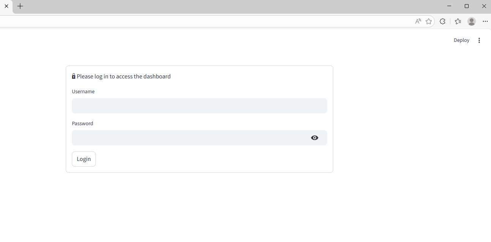
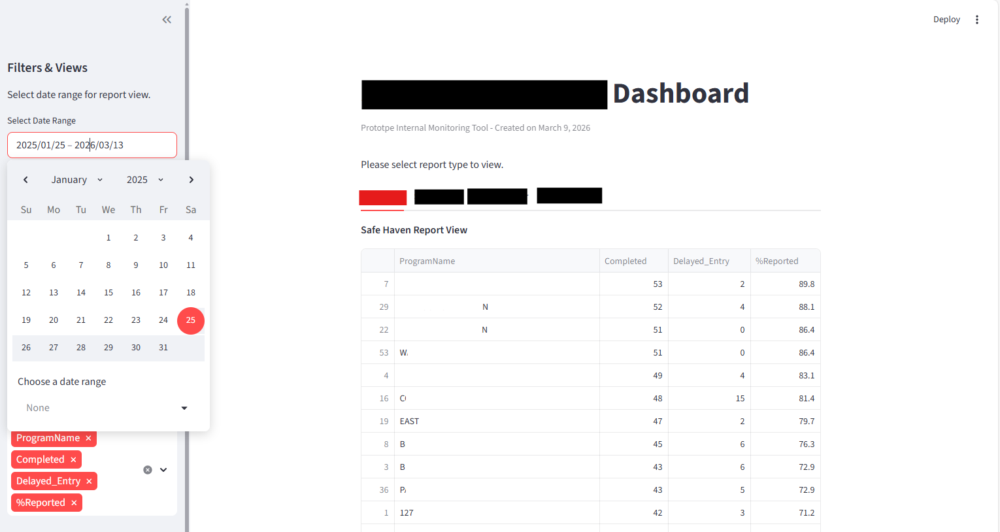

## Compliance Dashboard Prototype
- Writer: Hanna Lee
- Created Date: 3.9.2026

This project is a prototype internal dashboard built using Streamlit to monitor reporting compliace and capture delayed entries.

## Features

- Interactive data filtering
- Data table filters to select view for different reporting.
- Late submission tracking
- Downloadable data tables. 
- Secure login for inernal users.

## Project Structures

app.py
Main streamlit dashboard application 

utils.py
Contains helper functions for data processing and reporting tables. 

data_dummy/
Example dataset used for demonstration purposes.
Application is not updated for dummy data when pushed to github on 3.10.2026.

## Data Sources

The production version pulls data from a SQL Server database.
For security reasons, database credentials and real datasets are not included in this repository. 

## Running the App Locally

Install dependencies and run:

'''bash
streamlit run app.py

## Dashboard Preview 

Login Page for Internal Users

Masked Main Page with Date & Other Filters 

## Live Demo
URL: [https://](https://compliance-dashboard-demo-hanlee.streamlit.app/)
